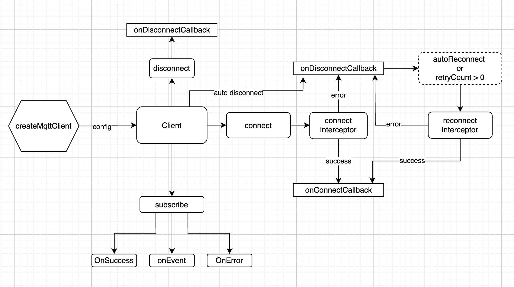

# d11-react-native-mqtt

Message Queuing Telemetry Transport (MQTT) is a lightweight, efficient, and reliable messaging protocol designed for low-bandwidth, high-latency, or unreliable networks.

MQTT operates on a publish/subscribe pattern, facilitating the decoupling of message senders (publishers) from message receivers (subscribers). This is achieved through the utilization of a central component known as a message broker, which orchestrates communication between publishers and subscribers.

This package provides MQTT functionality for React Native applications.

Internally, this package leverages [HiveMQTT](https://github.com/hivemq/hivemq-mqtt-client/tree/master?tab=readme-ov-file) for Android and [CocoaMQTT](https://github.com/emqx/CocoaMQTT) for iOS, ensuring seamless integration and optimal performance across both platforms.

- Contribution guidelines: [CONTRIBUTING.md](CONTRIBUTING.md)
- License: MIT
- MQTT resources:
  - [MQTT Essentials](https://www.hivemq.com/mqtt-essentials/)
  - [MQTT 5.0](https://docs.oasis-open.org/mqtt/mqtt/v5.0/os/mqtt-v5.0-os.html)

## Features

- API flavor:
  - Asynchronous API

- Backpressure support:
  - QoS 1 and 2
  - QoS 0 (dropping incoming messages, if necessary)
  - Bringing MQTT flow control and reactive pull backpressure together

- Transports:
  - TCP
  - SSL/TLS

- Automatic and configurable thread management
- Automatic and configurable reconnect handling
- Lifecycle listeners
  - When connected
  - When disconnected or connection failed


## Minimum Supported Version

This project requires the following minimum versions to function properly:
- **Java**: JDK 8 or higher
- **iOS**: iOS 12.0 or higher
- **Android**: API level 24 (Android 7.0) or higher

## Installation

```sh
using NPM
npm install @d11/react-native-mqtt

using Yarn
yarn add @d11/react-native-mqtt
```

### General configuration

|  Variable Name  |                                          Description                                         | Default value |
|:---------------:|:--------------------------------------------------------------------------------------------:|---------------|
|      topic      | A topic is a UTF-8 encoded string that is the basis for message routing in the MQTT protocol |      None     |
|     clientId    | The unique identifier of the MQTT client                                                     |      None     |
|       host      | The host name or IP address of the MQTT server                                               |      None     |
|       port      | The port of the MQTT server                                                                  |      None     |
|    keepAlive    | Keep the connection alive for mentioned time in seconds.                                     |     60 sec    |
|   cleanSession  | A flag to create new session or use old session while connecting                             |      true     |
|   backoffTime   | Time to wait before retrying connection                                                      |     2 sec     |
|  maxBackoffTime | Max time to wait before retrying connection                                                  |     60 sec    |
|      jitter     | Jitter is used to add randomness into backoff time                                           |        1      |
| enableSslConfig | A boolean indicating whether SSL/TLS configuration should be enabled                         |     false     |
|  autoReconnect  | A boolean to determine auto reconnection                                                     |      None     |
|    retryCount   | An integer to determine retry count                                                          |      None     |


#### Quality of Service (QoS)


|   Enum Name   |                              Description                              |
|:-------------:|:---------------------------------------------------------------------:|
| AT_MOST_ONCE  | QoS for at most once delivery as per the capabilities of the network. |
| AT_LEAST_ONCE | QoS for ensuring at least once delivery.                              |
| EXACTLY_ONCE  | QoS for ensuring exactly once delivery.                               |

### Creation of clients

```tsx
import { createMqttClient, MqttConfig } from "@d11/react-native-mqtt";
import { MqttClient } from "@d11/react-native-mqtt/dist/Mqtt/MqttClient";

export const createMqtt = (mqttConfig: MqttConfig): MqttClient => {
  const client = createMqttClient({
      clientId: mqttConfig.clientId,
      host: mqttConfig.host,
      port: mqttConfig.port,
      options: {
        password: '',
        enableSslConfig: false,
        autoReconnect: true,
        maxBackoffTime: mqttConfig.maxBackoffTime,
        retryCount: mqttConfig.connectRetryCount,
        cleanSession: mqttConfig.cleanSession,
        keepAlive: mqttConfig.keepAlive,
        jitter: mqttConfig.jitter,
        username: '',
      },
  });
  return client;
}
```


### Example

```tsx
import * as React from 'react';
import { StyleSheet, View, Text, Button } from 'react-native';
import { createMqtt } from './components/create-mqtt';
import { MqttClient } from '@d11/react-native-mqtt/dist/Mqtt/MqttClient';
import { MqttConfig } from "@d11/react-native-mqtt";

const mqttConfig: MqttConfig =  {
  "clientId": "mqttx_0121",
  "cleanSession": true,
  "host": "dummy.mqttx.com",
  "jitter": 1, 
  "keepAlive": 60,
  "maxBackoffTime": 60,
  "port": 8883,
  "retryCount": 3
}

enum MqttQos {
  AT_MOST_ONCE = 0,
  AT_LEAST_ONCE = 1,
  EXACTLY_ONCE = 2,
}

export default function App() {
  const [client, setClient] = React.useState<MqttClient | undefined>(undefined);

  const createMqttClient = () => {
    const newClient = createMqtt(MqttConfig);
    setClient(newClient);
  };

  const connectMqtt = () => {
    if (client) {
      client.connect();
    }
  };

  const disconnectMqtt = () => {
    if (client) {
      client.disconnect();
    }
  };

  const subscribeMQTT = () => {
    if(client){
      client.subscribe({
        topic: "sample_topic",
        qos: MqttQos.AT_LEAST_ONCE,
        onSuccess: (ack) => {
          console.log(`MQTT Subscription Success: ${ack}`);
        },
        onError: (error) => {
          console.log(`MQTT Subscription Failed: ${error}}`);
        },
        onEvent: ({ payload }) => {
          console.log(`MQTT Subscription data: ${payload}`);
        }
      })
    }
  }

  return (
    <View style={styles.container}>
      <Button
        title="Create Mqtt"
        color={'green'}
        onPress={createMqttClient}
      />
      <Button
        title="Connect Mqtt"
        color={'green'}
        onPress={connectMqtt}
      />
      
      <Button
        title="Subscribe MQTT"
        color={'green'}
        onPress={subscribeMQTT}
      />
      <Button
        title="Disconnect Mqtt"
        color={'red'}
        onPress={disconnectMqtt}
      />
    </View>
  );
}

const styles = StyleSheet.create({
  container: {
    flex: 1,
    alignItems: 'center',
    justifyContent: 'center',
  }
});
```

## API Support

- `createMqttClient`: A function that returns an instance of MqttClient with the given input config.

```tsx
createMqttClient: (config: MqttConfig) => MqttClient
const client = createMqttClient(config)

type MqttConfig = {
  clientId: string;
  host: string;
  port: number;
  options?: MqttOptions;
}

type MqttOptions = {
  keepAlive?: number;
  cleanSession?: boolean;
  username?: string;
  password?: string;
  maxBackoffTime?: number;
  backoffTime?: number;
  jitter?: number;
  enableSslConfig?: boolean;
  autoReconnect?: boolean;
  retryCount?: number;
}
```

- `connect`: connects to MQTT server with `auto-reconnect` and `retry` support.

```tsx
connect(options?: MqttOptions) => void

client.connect()
```

- `setOnConnectCallback`: Performs an action after connection is established.

```tsx
type onConnectCallback = (ack: MqttEventsInterface[MQTT_EVENTS.CONNECTED_EVENT]) => void

client.setOnConnectCallback(onConnectCallback)

MQTT_EVENTS {
  CONNECTED_EVENT = 'connected',
  DISCONNECTED_EVENT = 'disconnected',
  SUBSCRIPTION_EVENT = 'subscription_event',
  SUBSCRIPTION_SUCCESS_EVENT = 'subscribe_success',
  SUBSCRIPTION_FAILED_EVENT = 'subscribe_failed',
}
```

- `setOnConnectFailureCallback`: Sets a callback for handling connection failure events.

```tsx
type onConnectFailureCallback = (ack: MqttEventsInterface[MQTT_EVENTS.CONNECTED_EVENT]) => void

client.setOnConnectFailureCallback(onConnectFailureCallback)

Mqtt5ReasonCode {
  BAD_USER_NAME_OR_PASSWORD = 134,
  NOT_AUTHORIZED = 135,
  BAD_AUTHENTICATION_METHOD = 140,
  NORMAL_DISCONNECTION = 0,
  DEFAULT = -1,
  CONNECTION_ERROR = -2,
  DISCONNECTION_ERROR = -3,
  SUBSCRIPTION_ERROR = -4,
  UNSUBSCRIPTION_ERROR = -5,
  INITIALIZATION_ERROR = -6,
  RX_CHAIN_ERROR = -7
}
```

- `setOnErrorCallback`: Sets a callback for handling error events.

```tsx
type onErrorCallback = (ack: MqttEventsInterface[MQTT_EVENTS.ERROR_EVENT]) => void

client.setOnErrorCallback(onErrorCallback)

export enum MqttErrorType {
  INITIALIZATION = 'INITIALIZATION',
  CONNECTION = 'CONNECTION',
  SUBSCRIPTION = 'SUBSCRIPTION',
  UNSUBSCRIPTION = 'UNSUBSCRIPTION',
  DISCONNECTION = 'DISCONNECTION',
  GENERAL = 'GENERAL',
}
```

- `setOnDisconnectCallback`: Sets a callback for handling client disconnect events.

```tsx
type onDisconnectCallback = (ack: MqttEventsInterface[MQTT_EVENTS.DISCONNECTED_EVENT],
options: DisconnectCallback['options']) => void

client.setOnDisconnectCallback(onDisconnectCallback)
```

- `connectInterceptor`: Method to intercept connection options and may modify or override them.

```tsx
type connectInterceptor?: (options?: MqttOptions) => Promise<MqttConnect | undefined>

client.connectInterceptor()
```

- `reconnectInterceptor`: Method to intercept connection options and may modify or override them.

```tsx
type reconnectInterceptor?: (mqtt5ReasonCode?: Mqtt5ReasonCode) => Promise<MqttConnect | undefined>

client.reconnectInterceptor()
```

- `setOnReconnectInterceptor`: PerformS an action everytime before reconnect after first connect fails.

```tsx
type reconnectInterceptor = (
  mqtt5ReasonCode?: Mqtt5ReasonCode
) => Promise<MqttConnect | undefined>

client.setOnReconnectInterceptor(reconnectInterceptor)
```

- `setOnConnectFailureCallback`: Sets a callback for handling connection failure events.

```tsx
type onConnectFailureCallback = (ack: MqttEventsInterface[MQTT_EVENTS.CONNECTED_EVENT]) => void

client.setOnConnectFailureCallback(onConnectFailureCallback)
```

- `getConnectionStatus`: Gets the current connection status.

```tsx
getConnectionStatus: () => string
const status = client.getConnectionStatus();
```

- `getCurrentRetryCount`: Gets the current retry count.

```tsx
getConnectionStatus: () => number
const status = client.getCurrentRetryCount();
```

- `subscribe`: Subscribes to a topic with onEvent, onSuccess , onError callbacks support.

```tsx
subscribe: ({ topic, qos, onEvent, onSuccess, onError}: Subscribe) => void

client.subscribe({
  topic,
  qos,
  onEvent,
  onSuccess,
  onError,
})

type Subscribe = {
  topic: string;
  qos?: MqttQos;
  onEvent: (
    payload: MqttEventsInterface[MQTT_EVENTS.SUBSCRIPTION_EVENT]
  ) => void;
  onSuccess?: (
    ack: MqttEventsInterface[MQTT_EVENTS.SUBSCRIPTION_SUCCESS_EVENT]
  ) => void;
  onError?: (
    error: MqttEventsInterface[MQTT_EVENTS.SUBSCRIPTION_FAILED_EVENT]
  ) => void;
}
```

- `disconnect`: Disconnects with MQTT server.

```tsx
disconnect: () => void

client.disconnect();
```

- `remove`: Removes particular client.

```tsx
remove: () => void

client.remove();
```

## How does it work?



## Running example app

```sh
# install all packages
yarn

# for android
yarn example android

# for ios
yarn example ios
```

## Contributing

See the [contributing guide](CONTRIBUTING.md) to learn how to contribute to the repository and the development workflow.

## License

MIT
